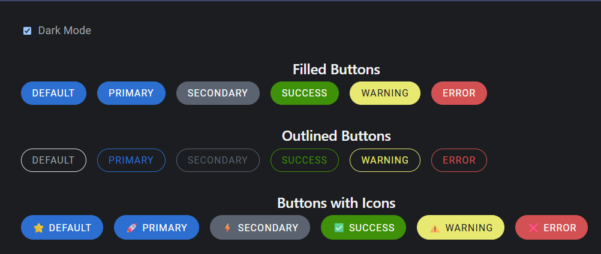

# HeadlessMUI

  
  

**Tagline:**  
> Headless Material-ready UI Components — fully unstyled, modular, and customizable for modern web apps.

---

## ⚠️ Disclaimer / Legal Notice
> **HeadlessMUI is an independent, open-source library.**  
> It is **not affiliated with, endorsed by, or officially connected** to Material-UI (MUI) or Tailwind Labs’ HeadlessUI.  
>  
> The library leverages Material Design CSS variables for styling flexibility but is fully developed and maintained independently.

---

## 🚀 Coming Soon
HeadlessMUI is currently under development! Upcoming releases will include:  
- **Core headless components**: Buttons, Inputs, Modals, Dropdowns, and more  
- **Material CSS variables integration** for full styling flexibility  
- **Comprehensive examples & documentation** for quick integration  
- **TypeScript support** for modern development workflows  

Stay tuned — exciting updates are on the way!  

---

## 💡 Why HeadlessMUI?
- **Headless & unstyled** — Keep full control over styling while using robust component logic  
- **Material-ready** — Integrates seamlessly with Material CSS variables for modern UI design  
- **Developer-focused** — Ideal for React, Next.js, and other modern frameworks  
- **Open-source & free** — Built for developers, by developers  

---

## 📚 Follow the Project
- **GitHub:** [https://github.com/headlessmui](https://github.com/headlessmui)  
- **Website / Docs:** Coming soon at [headlessmui.com](https://headlessmui.com)

---

## ❤️ Contributing
Even though components aren’t fully released yet, contributions are welcome!  
- Star the repo to stay updated  
- Watch for issues and early discussions on upcoming features  

---

## 📄 License
[MIT License](LICENSE)  